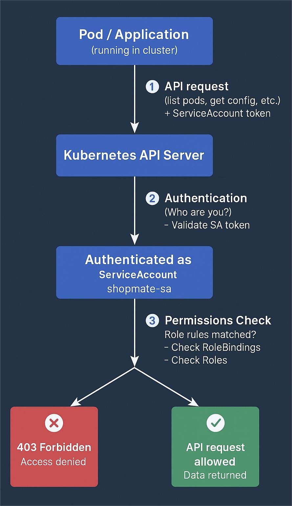

```
eksctl utils associate-iam-oidc-provider --cluster <your-cluster-name> --approve --region <your-region-code>
eksctl create iamserviceaccount --cluster <your-cluster-name> --namespace <namespace> --name <service-account-name> --attach-policy-arn <policy-arn> --approve
```

OpenID connect create

```
eksctl utils associate-iam-oidc-provider --cluster roboshop-dev --approve
```

Create service account

```
eksctl create iamserviceaccount --cluster roboshop-dev --name secret-reader --namespace roboshop --attach-policy-arn arn:aws:iam::160885265516:policy/RoboShopMySQLSecretReader --approve
```

Get secret value

```
aws secretsmanager get-secret-value --secret-id roboshop/dev/mysql_password --query SecretString --output text
```

## on cluster

kubectl get configmap aws-auth -n kube-system -o yaml -> never delete this
kubectl get configmap aws-auth -n kube-system -o yaml > aws-auth-backup.yaml -> take backup

kubectl get roles -n roboshop - get roles
kubectl delete roles roboshop-trainee -n roboshop

kubectl get rolebindings -n roboshop

## kubectl on different machine

step 1 : aws configure
step 2 : aws eks update-kubeconfig --region <region> --name <cluster_name>

check cluster name in eks
aws eks update-kubeconfig --region us-east-1 --name sampleapp

| Kubernetes  | Office Example               |
| ----------- | ---------------------------- |
| Role        | Job description              |
| RoleBinding | HR assigning job to employee |
| User        | Employee                     |
| Namespace   | Department                   |

```
         ┌───────────────┐
         │   IAM User    │
         │  (e.g., suresh)│
         └───────┬───────┘
                 │ AWS Credentials
                 ▼
        ┌─────────────────┐
        │   AWS EKS API   │
        │   (Authentication) │
        └────────┬────────┘
                 │ Checks aws-auth ConfigMap
                 ▼
       ┌─────────────────────┐
       │  Kubernetes User /  │
       │      Group          │
       │(e.g., roboshop-trainee) │
       └─────────┬───────────┘
                 │ RBAC Permissions
                 ▼
        ┌─────────────────┐
        │ Kubernetes API  │
        │ Authorization   │
        │ (Role/RoleBinding) │
        └─────────┬────────┘
                 │
                 ▼
            Allowed Actions
      (get pods, list pods, etc.)
```

---

### Explanation:

1. **IAM User/Role**

   - Your AWS identity (`suresh`, `akash`, or Node IAM Role).

2. **AWS EKS API Authentication**

   - EKS verifies the identity using IAM credentials.
   - Maps IAM identity → Kubernetes identity via **`aws-auth` ConfigMap**.

3. **Kubernetes User/Group**

   - The mapped username and group (`roboshop-trainee` or `roboshop-admin`).
   - This is now a valid Kubernetes identity.

4. **Kubernetes RBAC Authorization**

   - Kubernetes checks **Role / RoleBinding / ClusterRoleBinding** to see what this user/group can do.
   - For example:

     - `roboshop-trainee` → read-only access to pods
     - `roboshop-admin` → full cluster access

5. **kubectl / API Actions**

   - Only allowed if both authentication and authorization pass.

---

✅ **Key takeaway**:

- `aws-auth` is **only for authentication** (mapping AWS IAM → Kubernetes).
- RBAC is **for authorization** (what the user can actually do).
- Both together control who can access the cluster and what they can do.

---

## How authentication vs authorization works in EKS

1. **Authentication (aws-auth)**:

   - Who are you?
   - Done by IAM → AWS validates your identity.

2. **Authorization (RBAC in Kubernetes)**:

   - What can you do?
   - Done by Kubernetes roles/groups → e.g., `roboshop-trainee` can `get/list/watch pods` only.

So `aws-auth` only **maps IAM identity → Kubernetes identity/group**. After that, Kubernetes RBAC decides what actions are allowed.

---

| Resource           | Recommended Name           |
| ------------------ | -------------------------- |
| Role               | roboshop-admin-role        |
| RoleBinding        | roboshop-admin-rolebinding |
| ClusterRole        | roboshop-storage-ro-cr     |
| ClusterRoleBinding | roboshop-storage-ro-crb    |

---

**RBAC Group**

The name must be the same only in these two places:

1️⃣ aws-auth ConfigMap (group name)

2️⃣ RoleBinding → subjects[].name (group name)

👉 It does NOT need to be the same in the Role object. i want clearly like this

---

### The name must be the same **only in these two places**:

1️⃣ **aws-auth ConfigMap**
    → `groups: roboshop-trainee`

2️⃣ **RoleBinding**
    → `subjects[].name: roboshop-trainee`

---

👉 **It does NOT need to be the same in the `Role` object**

- `Role.metadata.name` can be **anything**
- It only needs to match `RoleBinding.roleRef.name`

---

### One-line rule 🧠

> **Group name must match between `aws-auth` and `RoleBinding`; Role name is independent.**

---

## 1️⃣ What is a Service Account?

- A **Service Account (SA)** is a **special Kubernetes user** that **pods can use** to interact with the Kubernetes API.
- Unlike human users, SAs are **designed for applications** (pods, controllers, etc.).
- Each SA gets a **token** mounted inside the pod, which the pod uses to authenticate with Kubernetes.

---

### Key Points

| Feature        | Description                                             |
| -------------- | ------------------------------------------------------- |
| Type           | Kubernetes identity for a pod/application               |
| Authentication | Via token stored in a secret, auto-mounted in the pod   |
| Default        | Every namespace gets a `default` SA                     |
| Use-case       | Grant permissions to pods using RBAC (Role/RoleBinding) |

---

## 2️⃣ Default Service Account

Every namespace has one:

```bash
kubectl get sa -n <namespace>
```

Example:

```
NAME      SECRETS   AGE
default   1         10d
```

- If you don’t specify an SA for a pod, it uses **`default`**.
- You can create custom SAs for more granular access.

---

## 3️⃣ Creating a Service Account

```yaml
apiVersion: v1
kind: ServiceAccount
metadata:
  name: roboshop-sa
  namespace: roboshop
```

- Creates a service account `roboshop-sa` in `roboshop` namespace.
- Kubernetes will automatically create a secret with a **token** for this SA.

---

## 4️⃣ Using a Service Account in a Pod

```yaml
apiVersion: v1
kind: Pod
metadata:
  name: myapp
  namespace: roboshop
spec:
  serviceAccountName: roboshop-sa
  containers:
    - name: app
      image: nginx
```

- Pod `myapp` now uses `roboshop-sa`.
- Any Kubernetes API requests from the pod are **authenticated as `roboshop-sa`**.

---

## 5️⃣ Granting Permissions via RBAC

You can bind Roles/ClusterRoles to a Service Account:

```yaml
apiVersion: rbac.authorization.k8s.io/v1
kind: RoleBinding
metadata:
  name: roboshop-sa-binding
  namespace: roboshop
subjects:
  - kind: ServiceAccount
    name: roboshop-sa
    namespace: roboshop
roleRef:
  kind: Role
  name: roboshop-pod-read
  apiGroup: rbac.authorization.k8s.io
```

- Grants **`roboshop-pod-read` permissions** to pods using `roboshop-sa`.
- Now, the pod can `get`, `list`, and `watch` pods in `roboshop`.

---

## 6️⃣ Service Account vs IAM Users / Groups

| Feature | Human User                | Service Account              |
| ------- | ------------------------- | ---------------------------- |
| Purpose | Human access              | Pod/application access       |
| Auth    | `kubectl` with kubeconfig | Token mounted in pod         |
| RBAC    | RoleBinding (User/Group)  | RoleBinding (ServiceAccount) |

---

### ✅ TL;DR

- **Service Accounts = identities for pods**
- **Use RBAC Role/RoleBinding to grant permissions**
- **Pods automatically authenticate using their SA token**

---



eksctl create iamserviceaccount --cluster sampleapp --namespace roboshop --name secret-reader-sa --attach-policy-arn arn:aws:iam::471112667143:policy/RoboshopMysqlRead --approve
